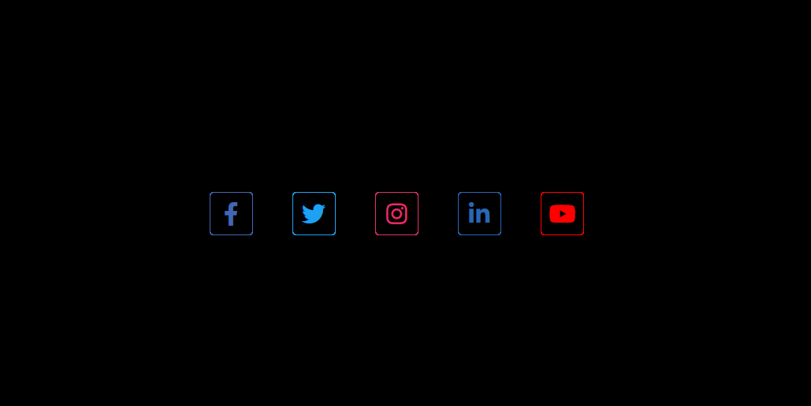
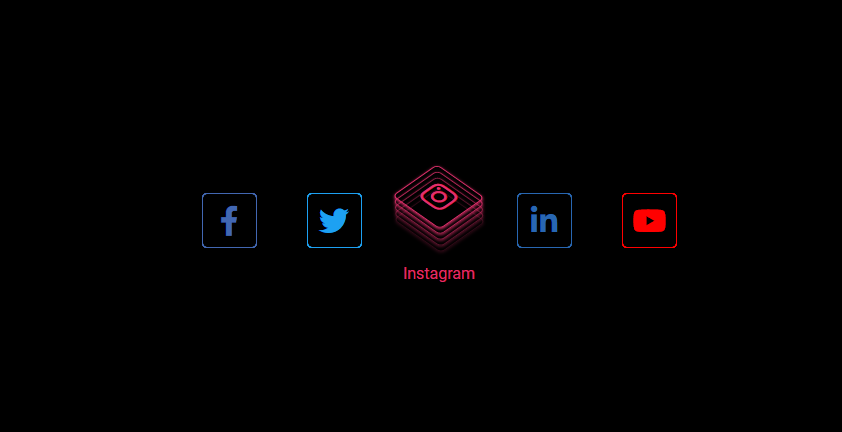

# 3DLayeredButton

### Project

- 개요 : CSS로 버튼을 3D Layered로 제작하였습니다.
- 언어 : HTML, CSS
- 기간 : 21.08.05

### 3D Button [Click here](https://won-jin-lee.github.io/CSS-3D-Layered-Button)

## Screen

|        |                          |
| ------ | ------------------------ |
| Before |  |
| Afrer  |   |
